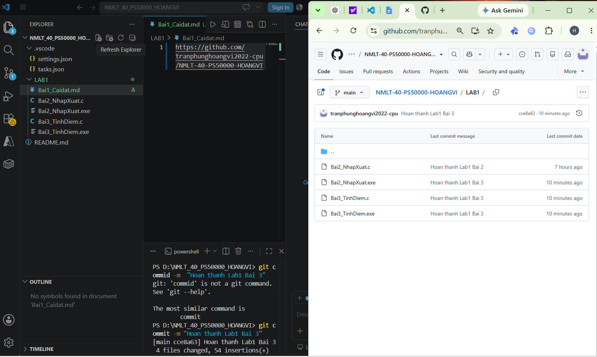

# Bài 1: Cài đặt và thiết lập môi trường

## Ảnh chứng minh

## Kết quả

- Đã cài đặt Visual Studio Code.
- Đã cài đặt GCC (MinGW).
- Đã cài đặt Git.
- Đã kết nối GitHub và push thành công.

## Link Repository

https://github.com/tranphunghoangvi2022-cpu/NMLT-40-PS50000-HOANGVI/tree/main/LAB1